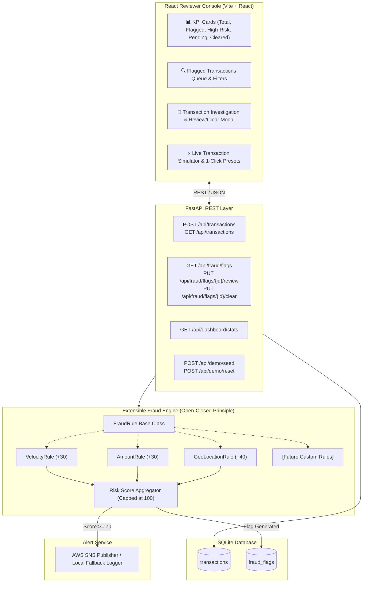

# 🛡️ SentinelGuard: Fraud Detection Rule Engine & Review Console

A real-time financial transaction risk evaluation engine and interactive React reviewer console built for high-throughput anomaly detection, automated risk scoring, and cloud-native alert broadcasting.

---

## 📌 Problem Statement & Requirements Fulfillment

This system satisfies **100% of the mandatory problem requirements**:

| Requirement | Implementation Details |
| :--- | :--- |
| **1. Rule Engine for Risk Evaluation** | Modular pipeline executing rules concurrently and computing cumulative risk scores (0–100). |
| **2. Velocity Rule** | Flags accounts exceeding 5 transactions within 5 minutes (`+30 pts`). |
| **3. Unusual Amount Rule** | Flags transactions exceeding configurable threshold ₹100,000 (`+30 pts`). |
| **4. Impossible Travel Rule** | Uses **Haversine formula** to compute physical travel speed between consecutive transactions; flags speeds > 900 km/h (`+40 pts`). |
| **5. Extensible Architecture** | Abstract `FraudRule` interface allowing new custom rules to be plugged in dynamically without modifying the engine. |
| **6. Transaction & Flag Persistence** | SQLite database with SQLAlchemy ORM capturing full transaction audits and fraud flags. |
| **7. React Reviewer Console** | Modern UI with real-time KPI metrics, search, risk pills, and detailed investigation drawer. |
| **8. Review / Clear Workflow** | Audit state transitions: `PENDING` $\rightarrow$ `REVIEWED` or `CLEARED` with reviewer notes. |
| **9. AWS SNS / SES Notifications** | Automatically broadcasts alerts when Risk Score $\ge 70$ (High Risk) with safe local fallback. |

---

## 🏗️ System Architecture



---

## 🧩 Extensible Rule Architecture

The engine strictly adheres to the **Open-Closed Principle (OCP)**. The core engine never uses hardcoded `if/else` checks for specific rules.

### How to add a new rule in 3 steps:

1. **Subclass `FraudRule`** in `backend/app/rules/`:
```python
from app.rules.base_rule import FraudRule, RuleResult

class DeviceChangeRule(FraudRule):
    def __init__(self, score: int = 25):
        self.name = "DEVICE_CHANGE"
        self.description = "Flags new device fingerprints."
        self.default_score = score

    def evaluate(self, transaction, context) -> RuleResult:
        prior_devices = context.get("known_devices", [])
        if transaction.device_id not in prior_devices:
            return RuleResult(
                rule_name=self.name,
                triggered=True,
                score_contribution=self.default_score,
                reason=f"Unrecognized device fingerprint: {transaction.device_id}"
            )
        return RuleResult(rule_name=self.name, triggered=False, score_contribution=0, reason="Known device.")
```

2. **Register with the engine**:
```python
engine.register_rule(DeviceChangeRule())
```

3. **That's it!** The engine will automatically evaluate the new rule, accumulate its score, and generate flags without any modifications to the engine core.

---

## 🧮 Built-in Fraud Detection Rules

### 1. Velocity Rule (`VELOCITY`)
- **Threshold**: More than 5 transactions for the same account within 5 minutes.
- **Score Contribution**: `+30 points`
- **Context**: Queries recent account transaction history in the configurable time window.

### 2. Unusual Amount Rule (`UNUSUAL_AMOUNT`)
- **Threshold**: Transaction amount exceeding `₹100,000`.
- **Score Contribution**: `+30 points`
- **Context**: Evaluates amount against configurable maximum baseline.

### 3. Impossible Geographical Location Rule (`IMPOSSIBLE_LOCATION`)
- **Distance Formula**: Haversine Great Circle Distance:
  $$d = 2R \arcsin\left(\sqrt{\sin^2\left(\frac{\Delta \text{lat}}{2}\right) + \cos(\text{lat}_1)\cos(\text{lat}_2)\sin^2\left(\frac{\Delta \text{lon}}{2}\right)}\right)$$
- **Velocity Formula**: $\text{Speed} = \frac{\text{Distance (km)}}{\Delta \text{Time (hours)}}$
- **Threshold**: Required travel speed $> 900\text{ km/h}$.
- **Score Contribution**: `+40 points`
- **Example**: Transaction at 10:00 AM in Hyderabad followed by 10:05 AM in London ($>7,700\text{ km}$ in 5 mins $\approx 92,400\text{ km/h}$) triggers an immediate flag.

---

## 📊 Risk Scoring Matrix

| Risk Score | Risk Level | System Action |
| :---: | :---: | :--- |
| **0 – 29** | `LOW` | Transaction approved. No flag created. |
| **30 – 69** | `MEDIUM` | Flagged as `PENDING` in Reviewer Console. |
| **70 – 100** | `HIGH` | Flagged as `PENDING` + **AWS SNS Notification dispatched**. |

---

## 🚀 Quick Start Guide

### Prerequisites
- Python 3.10+
- Node.js 18+ and npm

---

### Step 1: Start Backend

1. Open a terminal in `backend/`:
```bash
cd backend
pip install -r requirements.txt
```

2. (Optional) Configure `.env` if you have AWS SNS credentials:
```bash
cp .env.example .env
```
*(If left empty, high-risk notifications will automatically log in local simulation mode without error).*

3. Start the FastAPI server:
```bash
python -m uvicorn app.main:app --reload --port 8000
```
- API will be live at: **http://127.0.0.1:8000**
- Interactive Swagger UI: **http://127.0.0.1:8000/docs**

---

### Step 2: Seed Demo Data

In a new terminal window:
```bash
python backend/seed.py
```
*Alternatively, click the **"Seed Demo Data"** button directly inside the React UI.*

---

### Step 3: Start Frontend

1. Open a terminal in `frontend/`:
```bash
cd frontend
npm install
npm run dev
```
- Console will be live at: **http://localhost:5173**

---

## 🧪 Running Automated Tests

Run the test suite covering rule logic, engine scoring, risk levels, and API workflows:
```bash
pytest backend/tests -v
```

---

## 📡 REST API Documentation

### Transactions
- `POST /api/transactions` — Ingest and evaluate a new transaction.
- `GET /api/transactions` — List all ingested transactions with fraud metadata.
- `GET /api/transactions/{id}` — Get single transaction details.

### Fraud Flags & Review Console
- `GET /api/fraud/flags` — List flagged transactions (supports `?status=PENDING` and `?risk_level=HIGH` filters).
- `GET /api/fraud/flags/{id}` — Get flag details and triggered rule breakdowns.
- `PUT /api/fraud/flags/{id}/review` — Mark transaction as **REVIEWED** (Suspicious).
- `PUT /api/fraud/flags/{id}/clear` — Mark transaction as **CLEARED** (False Positive).

### Dashboard & Demo
- `GET /api/dashboard/stats` — Get real-time dashboard KPIs.
- `POST /api/demo/seed` — Populate rich demo dataset.
- `POST /api/demo/reset` — Reset database to clean state.

---

## 💡 Judge Demo Walkthrough Script

Follow these steps for a demonstration to judges:

1. **Dashboard Overview**:
   - Open **http://localhost:5173**.
   - Show KPI metrics (Total Transactions, Flagged, High Risk, Pending Review, Reviewed, Cleared).

2. **Demonstrate 1-Click Rule Presets**:
   - Click **"Ingest / Test Transaction"** in top right.
   - Click **"Trigger Velocity Rule (+30)"** $\rightarrow$ Submit $\rightarrow$ Observe `VELOCITY` rule flagged.
   - Click **"Trigger Unusual Amount (+30)"** $\rightarrow$ Submit $\rightarrow$ Observe `UNUSUAL_AMOUNT` rule flagged.
   - Click **"Trigger Impossible Travel (+40)"** $\rightarrow$ Submit $\rightarrow$ Observe `IMPOSSIBLE_LOCATION` rule flagged (Hyderabad $\rightarrow$ London in 5 mins).
   - Click **"Trigger High Risk & SNS (70+)"** $\rightarrow$ Submit $\rightarrow$ Observe `Score 70` (`HIGH`) and **AWS SNS notification broadcast**.

3. **Audit & Review Queue**:
   - In the Flagged Transactions table, click **"Inspect"** on any transaction.
   - View the exact mathematical speed calculation and breakdown reason.
   - Type audit notes (e.g., *"Customer confirmed foreign travel"*) and click **"Mark Reviewed"**.
   - Observe live status update to `REVIEWED` and KPI metrics updating immediately.
   - Click **"Clear"** on a false positive to transition to `CLEARED`.

4. **Interactive Swagger Documentation**:
   - Open **http://localhost:8000/docs** to demonstrate API schemas and test endpoints interactively.
